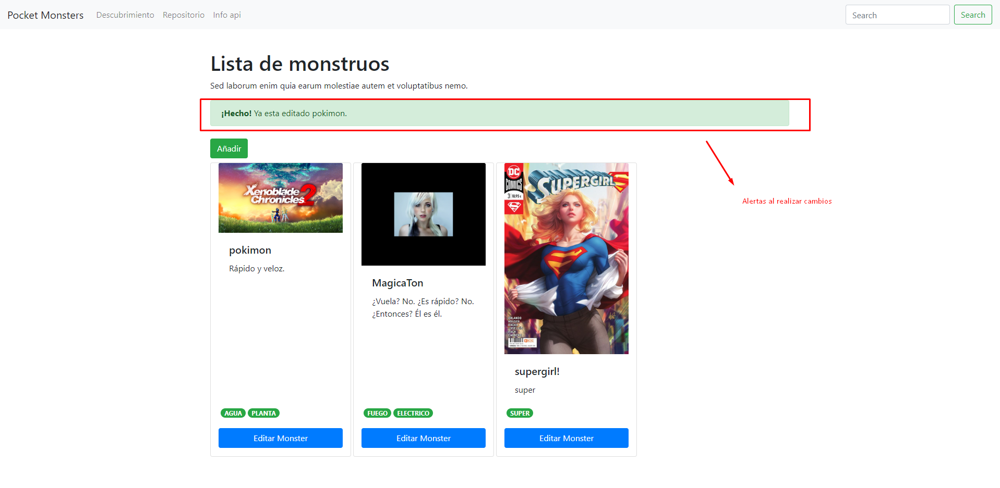

# NodeJS-QuickStart

## Aprendiendo NodeJs

## Proyecto Pocket Monsters
Crea, evoluciona y visita tus propias criaturas

- Backend: Api rest en NodeJs
- FrontEnd: Angular
- BBDD: MongoDB
- Design: Probando ngx-bootstrap/bootstrap4

----
Es una pequeña Aplicación para empezar con NodeJS, simplmente tenemos una pequeña interfaz en frontal con Angular 6 y una pequeña api rest en NodeJS que se encarga de guardar y recuperar la información de la base de datos de MongoDB.

En la app puedes crear 'Monsters', editarlos, eliminarlos e incluso subir su propia imagen, todo echo desde NodeJS en servidor.

Guardar imagenes en el servidor y recogerlas desde el servidor.

-----
# Arrancar el proyecto

## Dos opciones

## Desde local solo levantando NodeJS y MongoDB
Podemos levantar solo el servidor node y la base de datos
Y trabajar con el frontal subido en github en esta URL:
## https://davidmartinperez.github.io/apps/pocket-monsters/

Para lanzar MongoDB
````
C:\Program Files\MongoDB\Server\3.4\bin\mongod.exe
````
Lanzar la api rest
```node
cd backend-rest-nodejs
npm i
npm start
```
## Levantando todo en local

- Tendremos que tener instalado MongoDB y creado una BBDD llamada 'pocketMonster' con una colección llamada 'monsters', el fichero de la BBDD esta en la carpeta /mongodb/... , mis BBDD estan en el puerto :27017, puerto por defecto.

Para lanzar MongoDB
````
C:\Program Files\MongoDB\Server\3.4\bin\mongod.exe
````
- 'npm i' para las dependencias tanto en /backend-rest-nodejs como en /pocket-monsters.

- 'npm start' para arrancar la ApiRest (en su carpeta)

```node
cd backend-rest-nodejs
npm i
npm start
```
- ng serve -o para el frontal de Angular (en su carpeta)
```node
cd pocket-monsters
ng serve -o
```
---

## El componente de editar y crear son el mismo, se diferencias si se le ha pasado con @Input ya un registro para poder editar o no, si pulsamos el botón "editar Monster", se desplegará en un modal con datos rellenos y si pulsamos "Añadir" se abrirá en otra vista.

# Imagenes

- Inicio:
Con botones para añadir un nuevo registro o editar un registro


- Nuevo Registro


- Editar un registro


- Consola del servidor con Logs:
La consola muestra trazas de las peticiones con fechas, rutas y datos que se mandan y solicitan al servidor.


- Mensajes de alerta cuando hay algun fallo o todo funciono correctamente.



